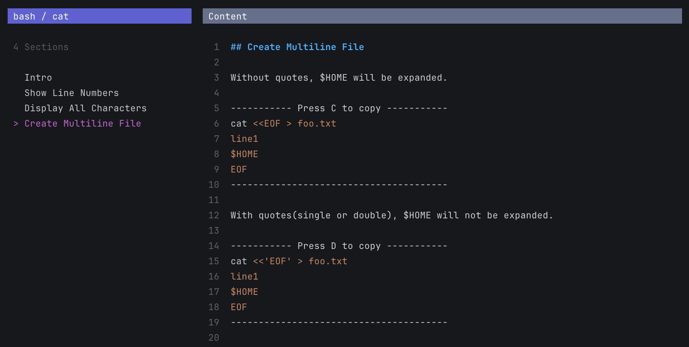
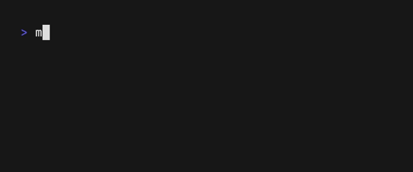

# Markdown Finder

> Forked from [maaslalani/nap](https://github.com/maaslalani/nap) which is a code snippet manager for your terminal.

Markdown Finder is a tool for quickly locating code snippets in Markdown files.
Use `---` to divide sections of a Markdown file,
making it easy to copy code from each section.


## Installation

Homebrew:

```bash
brew tap kugarocks/markdown-finder
```

```bash
brew install markdown-finder
```

Build from source:

```bash
go build -o mdf .
```

## Fuzzy Find Snippet

The `example.md` snippet will be found.

```bash
mdf examp
```

The `bash/cat.md` snippet will be found.

```bash
mdf bas/ca
```

If the snippet is specified, two panes are displayed by default.



## GitHub Source

Manage your source from GitHub by SSH.

```bash
mdf get source kugarocks/mdf-src
```

Supports HTTPS URL as well:

```bash
mdf get source https://github.com/kugarocks/mdf-src.git
```

The source will be downloaded to `~/.mdf/sources/`.

```bash
.mdf
├── config.yaml
└── sources
    ├── kugarocks
    │   └── mdf-src
    │       ├── README.md
    │       ├── bash
    │       │   ├── cat.md
    │       │   └── ls.md
    │       ├── cloud-native
    │       │   └── k8s.md
    │       └── snippet-config.json
    ├── local
    │   └── source
    │       ├── folder
    │       │   └── Example.md
    │       └── snippet-config.json
    └── source-config.json
```

## Switch Source

```bash
mdf set source
```



## Switch Folder

```bash
mdf set folder
```


## Configuration

The config file defaults to `~/.mdf/`. Set the `MDF_HOME` environment variable to change it.

```bash
export MDF_HOME=/path/to/mdf
```

## config.yaml

Feel free to customize the following configuration.

```yaml
source_name: local/source
folder_name: folder
source_config_file: source-config.json
snippet_config_file: snippet-config.json
default_pane: section
always_show_snippet_pane: false
base_margin_top: 1
snippet_title_bar_width: 33
section_title_bar_width: 33
content_title_bar_width: 86
snippet_list_margin_left: 1
focused_bar_bg_color: "62"
focused_bar_fg_color: "230"
blurred_bar_bg_color: '#64708D'
blurred_bar_fg_color: '#FFFFFF'
selected_item_fg_color: "170"
unselected_item_fg_color: c7c7c7
copied_bar_bg_color: '#527251'
copied_bar_fg_color: '#FFFFFF'
copied_item_fg_color: '#BCE1AF'
content_line_number_fg_color: "241"
theme: dracula
code_block_border_padding: '-'
code_block_border_length: 39
code_block_title_copy: Press {key} to copy
copy_content_keys: [c, d, e, f, g]
edit_snippet_keys: [i]
next_pane_keys: ["n", tab, right]
prev_pane_keys: ["N", shift+tab, left]
```

| Key        | Description                   |
|---------------------------|-------------------------------|
| source_name               | Set by `mdf set source`       |
| folder_name               | Set by `mdf set folder`       |
| default_pane              | `section` or `snippet`        |
| always_show_snippet_pane  | `true` or `false`             |

## License

[MIT](https://github.com/maaslalani/nap/blob/master/LICENSE)
