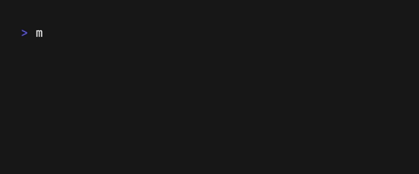

# Markdown Finder

> Forked from [maaslalani/nap](https://github.com/maaslalani/nap) which is a code snippet manager for your terminal.

Markdown Finder is a tool for quickly locating code snippets in Markdown files.
Use `---` to divide sections of a Markdown file,
making it easy to copy code from each section.


## Installation

Homebrew:

```bash
brew tap kugarocks/markdown-finder
```

```bash
brew install markdown-finder
```

Upgrade:

```bash
brew update && brew reinstall markdown-finder
```

Build from source:

```bash
go build -o mdf .
```

## Fuzzy Find Snippet

The `example.md` snippet will be found.

```bash
mdf examp
```

The `bash/cat.md` snippet will be found.

```bash
mdf bas/ca
```

If the snippet is specified, two panes are displayed by default.
Toggle the snippet pane by pressing `s` or `p`.


## GitHub Repository

Manage your snippets by GitHub repository(SSH).

```bash
mdf get repo kugarocks/rockman
```

Supports HTTPS URL as well:

```bash
mdf get repo https://github.com/kugarocks/rockman.git
```

The repo will be downloaded to `~/.mdf/repos/`.

```txt
.mdf
├── config.yaml
└── repos
    ├── kugarocks
    │   └── rockman
    │       ├── README.md
    │       ├── bash
    │       │   ├── cat.md
    │       │   └── ls.md
    │       ├── cloud-native
    │       │   └── k8s.md
    │       └── snippet-config.json
    ├── local
    │   └── repo
    │       ├── folder
    │       │   └── Example.md
    │       └── snippet-config.json
    └── repo-config.json
```

The `repo-config.json` file is automatically updated when you run `mdf get repo`.
If you manually add repo to `~/.mdf/repos/`, you will also need to manually update `repo-config.json`.

## Switch Repo

```bash
mdf set repo
```



## Switch Folder

```bash
mdf set folder
```


## Raycast Script Command

You can use the following command as a Raycast script command.

* `LANG=en_US.UTF-8`: Emoji support.
* `MDF_HOME`: MDF home path.
* `--config-file`: Alacritty config file path.

```bash
LANG=en_US.UTF-8 \
MDF_HOME=/Users/kuga/mdf \
/Applications/Alacritty.app/Contents/MacOS/alacritty \
    --config-file /Users/kuga/alacritty.toml \
    -e /usr/local/bin/mdf "$1" \
    > /dev/null 2>&1
```

## Configuration

The config file defaults to `~/.mdf/`. Set the `MDF_HOME` environment variable to change it.

```bash
export MDF_HOME=/path/to/mdf
```

## config.yaml

Feel free to customize the following configuration.

```yaml
repo_name: local/repo
folder_name: folder
repo_config_file: repo-config.json
snippet_config_file: snippet-config.json
default_pane: section
always_show_snippet_pane: false
exit_after_copy: false
base_margin_top: 1
snippet_title_bar_width: 33
section_title_bar_width: 33
content_title_bar_width: 86
snippet_list_margin_left: 1
focused_bar_bg_color: "62"
focused_bar_fg_color: "255"
blurred_bar_bg_color: "103"
blurred_bar_fg_color: "255"
selected_item_fg_color: "170"
unselected_item_fg_color: "252"
copied_bar_bg_color: "42"
copied_bar_fg_color: "238"
copied_item_fg_color: "42"
content_line_number_fg_color: "241"
theme: dracula
code_block_border_padding: '-'
code_block_border_length: 39
code_block_title_copy: Press {key} to copy
copy_content_keys: [c, d, e, f, g]
edit_snippet_keys: [i]
next_pane_keys: ["n", tab, right]
prev_pane_keys: ["N", shift+tab, left]
toggle_snippet_pane_keys: [s, p]
```

| Key                      | Description             |
|--------------------------|-------------------------|
| repo_name                | Set by `mdf set repo`   |
| folder_name              | Set by `mdf set folder` |
| default_pane             | `section` or `snippet`  |
| always_show_snippet_pane | `true` or `false`(default) |
| exit_after_copy          | `true` or `false`(default) |

## Exit After Copy

You can also press `shift` + `copy_content_keys` to copy the content and exit.

## TODO

- [ ] Update `repo-config.json` when repo is added manually.

## License

[MIT](https://github.com/maaslalani/nap/blob/master/LICENSE)
