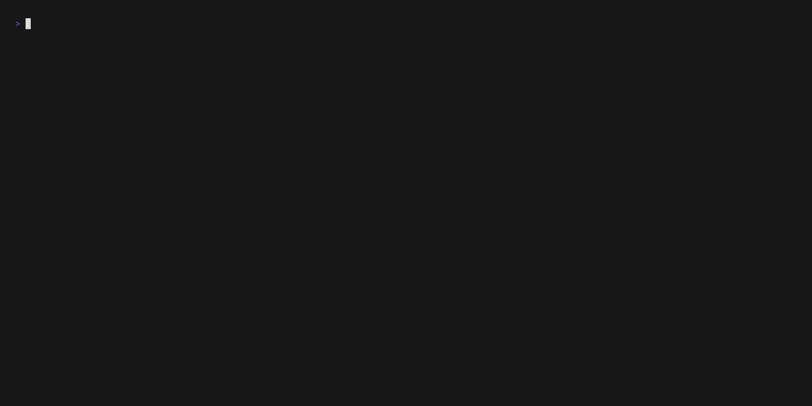

# Markdown Finder

> Forked from [maaslalani/nap](https://github.com/maaslalani/nap) which is a code snippet manager for your terminal.

Markdown Finder is a tool for quickly locating code snippets in Markdown files.
Use `---` to divide sections of a Markdown file,
making it easy to copy code from each section.



## Installation

Build from source:

```bash
go build -o mdf .
```

## GitHub Source

You can manage or share your source by GitHub.
The following command will clone `git@github.com:kugarocks/mdf-src-en.git`.

```bash
mdf get source kugarocks/mdf-src-en
```

Supports HTTPS URL as well:

```bash
mdf get source https://github.com/kugarocks/mdf-src-en.git
```

The source will be downloaded to `~/.mdf/sources/`.

```bash
.mdf
├── config.yaml
└── sources
    ├── kugarocks
    │   └── mdf-src-en
    │       ├── README.md
    │       ├── bash
    │       │   ├── cat.md
    │       │   └── ls.md
    │       ├── cloud-native
    │       │   └── k8s.md
    │       └── snippet-config.json
    ├── local
    │   └── source
    │       ├── folder
    │       │   └── Example.md
    │       └── snippet-config.json
    └── source-config.json
```

## Switch Source

```bash
mdf set source
```


## Switch Folder

```bash
mdf set folder
```


## Fuzzy Find Snippet

The `example` snippet will be found.

```bash
mdf examp
```

## Configuration

This configuration file is located at `~/.mdf/` by default.
You can change by setting the `MDF_HOME` environment variable.

```bash
export MDF_HOME=/path/to/mdf
```

## config.yaml

```yaml
source_name: local/source
folder_name: folder
source_config_file: source-config.json
snippet_config_file: snippet-config.json
default_pane: section
always_show_snippet_pane: false
base_margin_top: 1
snippet_title_bar_width: 33
section_title_bar_width: 33
content_title_bar_width: 86
snippet_list_margin_left: 1
focused_bar_bg_color: "62"
focused_bar_fg_color: "230"
blurred_bar_bg_color: '#64708D'
blurred_bar_fg_color: '#FFFFFF'
selected_item_fg_color: "170"
unselected_item_fg_color: c7c7c7
copied_bar_bg_color: '#527251'
copied_bar_fg_color: '#FFFFFF'
copied_item_fg_color: '#BCE1AF'
content_line_number_fg_color: "241"
theme: dracula
code_block_prefix: '------------- CodeBlock -------------'
code_block_suffix: '---------------- End ----------------'
code_block_copied_hint: '---------- Press %s to copy ----------'
```

## TODO

- [ ] Add copied keys configuration
- [ ] Add Homebrew installation
- [ ] Add apt-get installation
- [ ] Add more documentation
- [ ] Clean up code

## License

[MIT](https://github.com/maaslalani/nap/blob/master/LICENSE)
